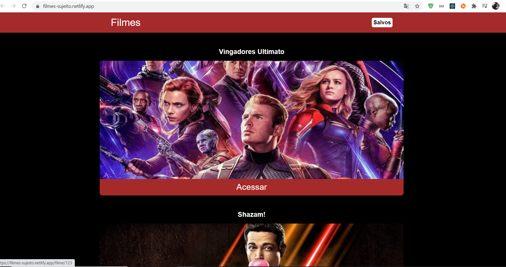
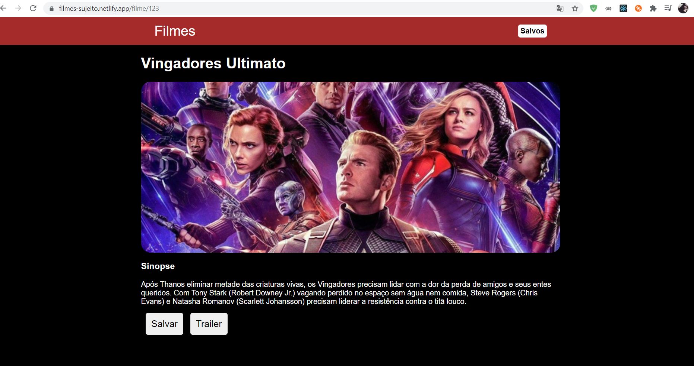

# Projeto Filmes


# Página Home da Aplicação
<p>Nesta sessão é possivel acessar a lista de filmes disponiveis no projeto.</p>
<h1 align="center">
    
</h1>


# Página de Detalhes do Filme
<p>Nesta sessão é possivel ler a sinopse do filme e salvar o filme ou ver o Trailer.</p>
<h1 align="center">
    
</h1>


# Follow the steps below:
```bash
# Install the dependencies
$ yarn install

# Start the project
$ yarn start


